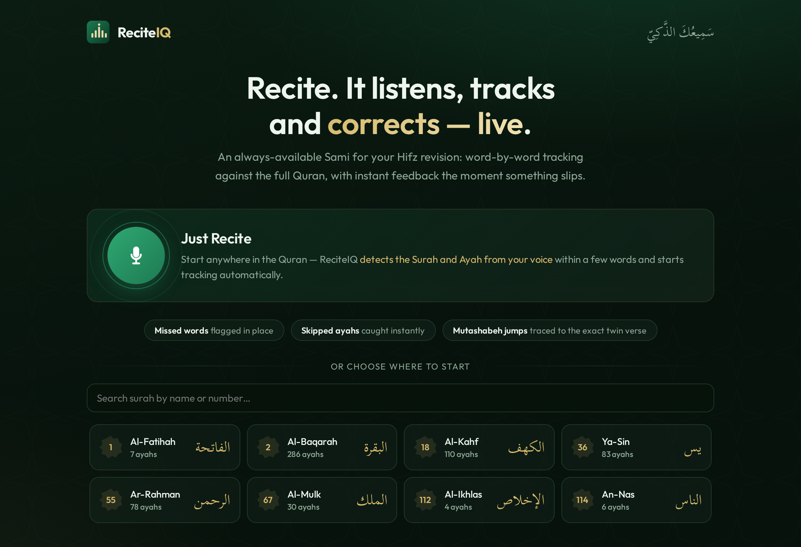
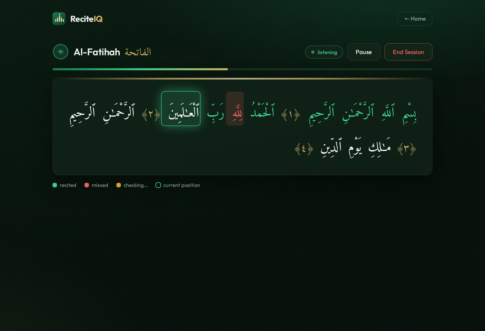
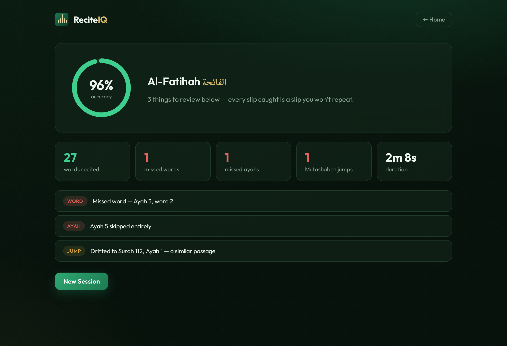

<div align="center">

# 🕌 ReciteIQ

### Smart Quran Recitation Alignment &amp; Correction

**Your AI _Sami_ (listener) for Hifz revision.** Recite into your browser — ReciteIQ
transcribes your Arabic in real time, tracks it word-by-word against the full Quran,
and instantly flags **missed words**, **missed ayahs**, and **Mutashabeh jumps**
(drifting into a similar verse elsewhere).

🔗 **Live demo:** [reciteiq.wiserhelpdesk.com](https://reciteiq.wiserhelpdesk.com)


</div>

---

## ✨ What it does

|  | Feature |
|---|---|
| 🎙️ | **Just Recite** — start anywhere; ReciteIQ auto-detects the Surah &amp; Ayah from your opening words |
| 🟢 | **Live word tracking** — every word turns green the instant it's recited correctly |
| 🔴 | **Missed-word detection** — skipped words within an ayah are flagged in place |
| ⏭️ | **Missed-ayah detection** — skipping a whole verse is caught (pause-aware: a breath never triggers it) |
| ⚠️ | **Mutashabeh-jump detection** — drift into a similar verse is traced to the exact destination Surah:Ayah |
| 📊 | **Session summary** — accuracy ring + a reviewable list of every slip |
| 🔒 | **Privacy-first** — audio is processed in memory and never stored; only text results are saved |

## 📸 Screenshots

| Home | Live recitation | Summary |
|:---:|:---:|:---:|
|  |  |  |

## 🏗️ Architecture

```
Browser SPA (React + Vite + TS)            Backend (FastAPI — single service)
  mic → AudioWorklet → 16k PCM  ──ws──►  silero VAD (ONNX) → smart-cut segments
  green/red MushafView          ◄─events─  → Whisper (local Quran-tuned, or Groq cloud)
  live voice ring · progress bar           → Arabic normalize → windowed fuzzy aligner
                                           → detector (miss / repeat / jump state machine)
                                           → 3-gram relocation index (Mutashabeh + auto-detect)
                                        PostgreSQL: dual-script words, sessions, events
```

**Why dual-script word data:** ASR emits *standard* orthography, but the Uthmani
rasm differs (ٱلصَّلَوٰةَ vs الصلاة). Every word is stored twice — Uthmani for
display, normalized Imlaei for matching — sourced from the quran.com word-by-word API.

## 🧠 The interesting engineering

- **Two ML layers, no GPU.** Quran-fine-tuned Whisper (int8 on CPU, ~0.45× realtime) for
  speech, and a lexical word-3-gram inverted index for Mutashabeh similarity — deterministic,
  interpretable, and tiny in RAM. No embeddings, no vector DB.
- **Auto-detection** reuses that index with fuzzy, noise-tolerant diagonal seed-chaining, so
  it locks on even when ~30% of a consumer-mic transcript is garbled.
- **Pause-aware "wait and listen"** — VAD silence is the pause signal, so normal breathing
  never raises a false missed-ayah.
- **Self-correcting verdicts** — a word flagged missed is automatically un-flagged if it's
  matched later; dangling "checking…" words resolve in the reciter's favor at session end.
- **Production-hardened** — concurrent-session caps, per-IP limits, ingest rate limiting,
  reconnect-and-resume, Alembic migrations, nightly backups.

## 🛠️ Tech stack

| Layer | Choice |
|---|---|
| **Frontend** | React 19, Vite, TypeScript, AudioWorklet mic capture |
| **Backend** | FastAPI, WebSockets, asyncio |
| **ASR** | faster-whisper (CT2 int8, Quran-tuned) — *or* Groq `whisper-large-v3-turbo` (cloud, optional) |
| **VAD** | silero-vad (vendored ONNX, no torch) |
| **Matching** | rapidfuzz (Levenshtein), custom alignment + detection engine |
| **Database** | PostgreSQL 16, SQLAlchemy, Alembic |
| **Deploy** | Docker Compose behind an nginx edge (SNI TLS) |

## 🚀 Quick start (local)

```bash
# 1. Database
cd deploy && docker compose up -d db        # Postgres on 127.0.0.1:19832

# 2. Backend
cd ../backend && python3 -m venv .venv && .venv/bin/pip install -e ".[asr,dev]"
.venv/bin/python -m scripts.load_quran       # one-time: load the Quran (self-verifying)
.venv/bin/python -m scripts.build_mutashabeh # one-time: build twin-verse table
# place a CT2 Whisper model in backend/models/ (see scripts/bench_asr.py)
.venv/bin/uvicorn app.main:app --port 8000

# 3. Frontend
cd ../frontend && npm install && npm run dev  # SPA on :5173 (proxies /api + /ws)
```

Run the tests: `cd backend && .venv/bin/python -m pytest` (25 hard-case fixtures).
Test the full pipeline without a mic: `python -m scripts.ws_client eval/audio/fatiha_full.wav 1`.

### Optional: cloud ASR (Groq)

The local model is great on clean recitation; for noisy consumer mics, Groq's
`whisper-large-v3-turbo` is a bigger model and **free to test** (2,000 req/day).

```bash
export RECITEIQ_ASR_ENGINE=cloud
export RECITEIQ_GROQ_API_KEY=gsk_...   # free key: https://console.groq.com
```

It auto-falls back to the local engine on any network/rate-limit error, so a
session never dies on a blip.

## 🐳 Production deploy

```bash
cd deploy && docker compose build && docker compose up -d
cp deploy/reciteiq.cron /etc/cron.d/reciteiq   # nightly backup + event retention
```

## 📈 Measured

- **ASR:** Quran-tuned Whisper-base CT2 int8 — RTF 0.45 solo, p95 ~2.7s/segment at 3 concurrent
  sessions; 100% token accuracy on clean qari clips.
- **Detection (live):** clean recitation → 0 false events · skipped ayah → exactly one MISSED_AYAH ·
  drift to a twin verse → MUTASHABEH_JUMP with the correct destination.

## 🗺️ Roadmap

Accounts &amp; progress dashboards · Tajweed feedback · richer cloud-ASR options ·
amateur-voice evaluation corpus.

## 👤 Authors

**Huzaifa Naseer** &amp; **Muhammad Abdullah Awais** — Final Year Project,
Institute of Computer Science, Khwaja Fareed University of Engineering &amp; Information Technology.

<div align="center">
<sub>Built to support Hifz and Nazra students — may it be of benefit. 🤲</sub>
</div>
