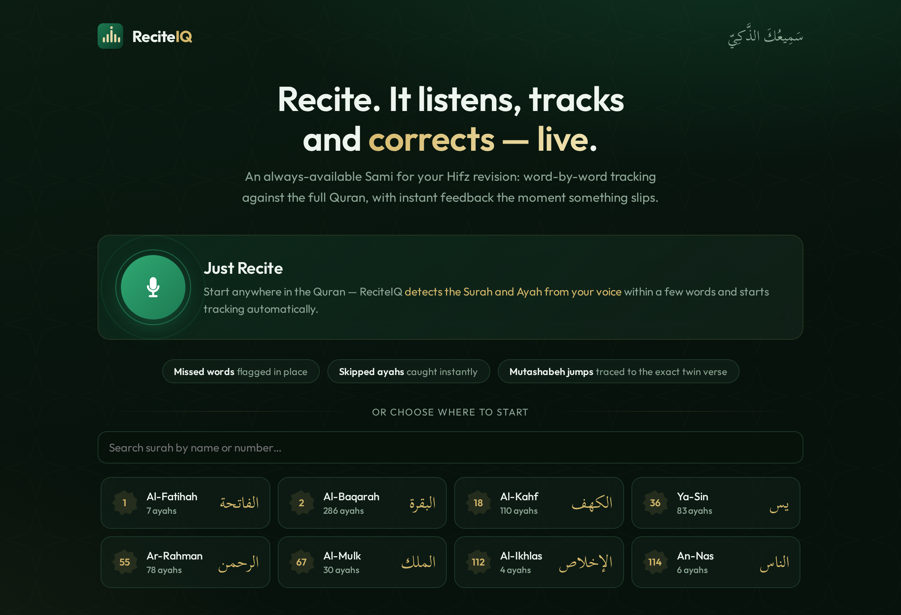
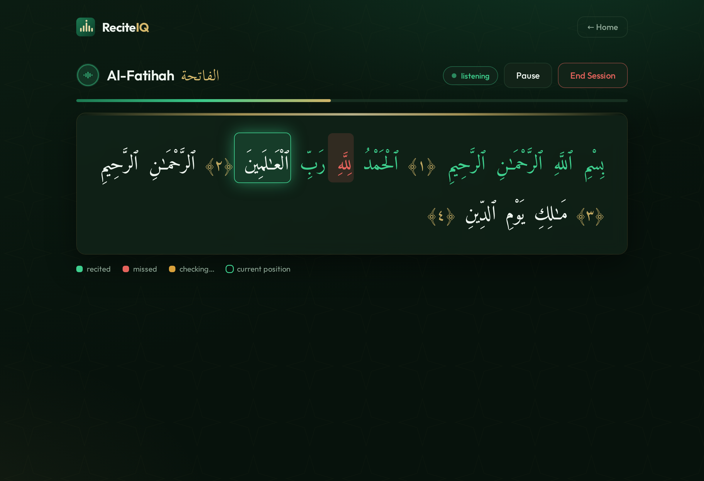
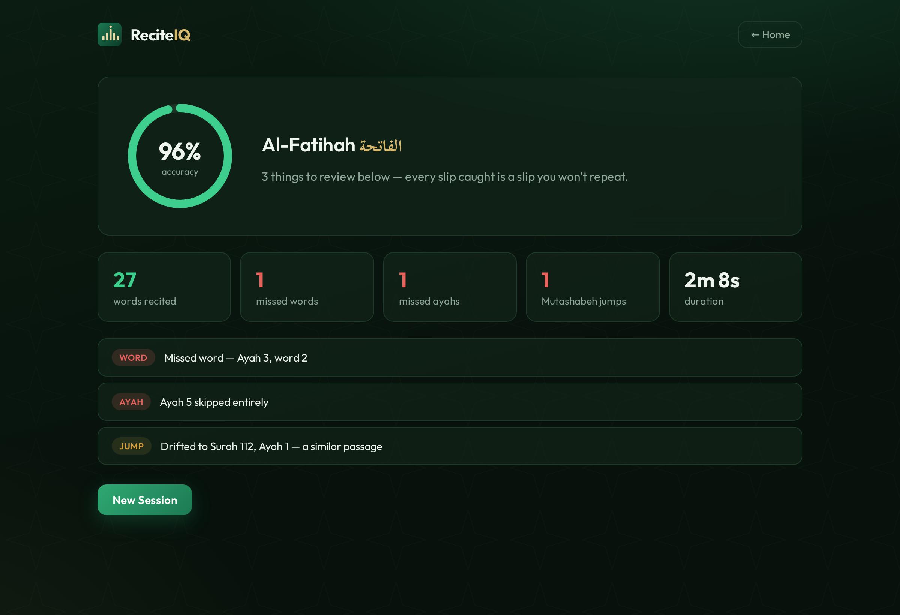

<div align="center">

# 🕌 ReciteIQ

### Smart Quran Recitation Alignment &amp; Correction

**Your AI _Sami_ (listener) for Hifz revision.** Recite into your browser — ReciteIQ
transcribes your Arabic in real time, tracks it word-by-word against the full Quran,
and instantly flags **missed words**, **missed ayahs**, and **Mutashabeh jumps**
(drifting into a similar verse elsewhere).

🔗 **Live demo:** [reciteiq.wiserhelpdesk.com](https://reciteiq.wiserhelpdesk.com)


</div>

---

## ✨ What it does

|  | Feature |
|---|---|
| 🎙️ | **Just Recite** — start anywhere; ReciteIQ auto-detects the Surah &amp; Ayah from your opening words |
| 🟢 | **Live word tracking** — every word turns green the instant it's recited correctly |
| 🔴 | **Missed-word detection** — skipped words within an ayah are flagged in place |
| ⏭️ | **Missed-ayah detection** — skipping a whole verse is caught (pause-aware: a breath never triggers it) |
| ⚠️ | **Mutashabeh-jump detection** — drift into a similar verse is traced to the exact destination Surah:Ayah |
| 📊 | **Session summary** — accuracy ring + a reviewable list of every slip |
| 🔒 | **Privacy-first** — audio is processed in memory and never stored; only text results are saved |

## 📸 Screenshots

| Home | Live recitation | Summary |
|:---:|:---:|:---:|
|  |  |  |

## 🏗️ Architecture

```
Browser SPA (React + Vite + TS)            Backend (FastAPI — single service)
  mic → AudioWorklet → 16k PCM  ──ws──►  silero VAD (ONNX) → smart-cut segments
  green/red MushafView          ◄─events─  → NeMo FastConformer (Quran-fine-tuned)
  live voice ring · progress bar           → Arabic normalize → windowed fuzzy aligner
                                           → detector (miss / repeat / jump state machine)
                                           → 3-gram relocation index (Mutashabeh + auto-detect)
                                        PostgreSQL: dual-script words, sessions, events
```

**Why dual-script word data:** ASR emits *standard* orthography, but the Uthmani
rasm differs (ٱلصَّلَوٰةَ vs الصلاة). Every word is stored twice — Uthmani for
display, normalized Imlaei for matching — sourced from the quran.com word-by-word API.

## 🧠 The interesting engineering

- **Two ML layers, no GPU.** Quran-fine-tuned Whisper (int8 on CPU, ~0.45× realtime) for
  speech, and a lexical word-3-gram inverted index for Mutashabeh similarity — deterministic,
  interpretable, and tiny in RAM. No embeddings, no vector DB.
- **Auto-detection** reuses that index with fuzzy, noise-tolerant diagonal seed-chaining, so
  it locks on even when ~30% of a consumer-mic transcript is garbled.
- **Pause-aware "wait and listen"** — VAD silence is the pause signal, so normal breathing
  never raises a false missed-ayah.
- **Self-correcting verdicts** — a word flagged missed is automatically un-flagged if it's
  matched later; dangling "checking…" words resolve in the reciter's favor at session end.
- **Production-hardened** — concurrent-session caps, per-IP limits, ingest rate limiting,
  reconnect-and-resume, Alembic migrations, nightly backups.

## 🛠️ Tech stack

| Layer | Choice |
|---|---|
| **Frontend** | React 19, Vite, TypeScript, AudioWorklet mic capture |
| **Backend** | FastAPI, WebSockets, asyncio |
| **ASR** | NeMo FastConformer, Quran-fine-tuned (`mohammed/fastconformer-quran-ar`) — *or* faster-whisper / Groq, both retained behind a flag |
| **VAD** | silero-vad (vendored ONNX, no torch) |
| **Matching** | rapidfuzz (Levenshtein), custom alignment + detection engine |
| **Database** | PostgreSQL 16, SQLAlchemy, Alembic |
| **Deploy** | Docker Compose behind an nginx edge (SNI TLS) |

## 🚀 Quick start (local)

```bash
# 1. Database
cd deploy && docker compose up -d db        # Postgres on 127.0.0.1:19832

# 2. Backend
cd ../backend && python3 -m venv .venv && .venv/bin/pip install -e ".[asr,dev]"
.venv/bin/python -m scripts.load_quran       # one-time: load the Quran (self-verifying)
.venv/bin/python -m scripts.build_mutashabeh # one-time: build twin-verse table
# place a CT2 Whisper model in backend/models/ (see scripts/bench_asr.py)
.venv/bin/uvicorn app.main:app --port 8000

# 3. Frontend
cd ../frontend && npm install && npm run dev  # SPA on :5173 (proxies /api + /ws)
```

Run the tests: `cd backend && .venv/bin/python -m pytest` (25 hard-case fixtures).
Test the full pipeline without a mic: `python -m scripts.ws_client eval/audio/fatiha_full.wav 1`.

### Optional: cloud ASR (Groq)

The local model is great on clean recitation; for noisy consumer mics, Groq's
`whisper-large-v3-turbo` is a bigger model and **free to test** (2,000 req/day).

```bash
export RECITEIQ_ASR_ENGINE=cloud
export RECITEIQ_GROQ_API_KEY=gsk_...   # free key: https://console.groq.com
```

It auto-falls back to the local engine on any network/rate-limit error, so a
session never dies on a blip.

## 🐳 Production deploy

```bash
cd deploy && docker compose build && docker compose up -d
cp deploy/reciteiq.cron /etc/cron.d/reciteiq   # nightly backup + event retention
```

The engine is chosen in `deploy/.env` (gitignored). One image carries both
FastConformer and faster-whisper, so switching engines never needs a rebuild —
see `docs/runbook-engine-rollback.md`. Do **not** set `RECITEIQ_SEGMENT_MAX_SEC`:
the engine selects the window the release gate measured, and overriding it
silently costs the result.

After any deploy touching the ASR path or the tracker:

```bash
backend/.venv/bin/python backend/scripts/release_regression.py https://your-host
```

## 📈 Measured

Every figure below is from a script in `backend/scripts/`, on this hardware, with
real recitations by an amateur reciter — not a qari, and not a benchmark set.

**ASR.** FastConformer scores WER 0.0443 over six real amateur recitations, and
it transcribes what was *spoken* rather than what was expected: given a
deliberately wrong `زلسالها` — a word occurring nowhere in the Qur'an — it wrote
`زلسالها`. A recogniser that repairs mistakes is useless for a Sami.

**Detection, six surahs, strict full-word metric** (`docs/gate-release.md`):

| | result |
|---|---|
| clean recitation | 71/74 ayahs, **zero** false MISSED_WORD / MISSED_AYAH / jump |
| skipped word | the *specific* removed word flagged, 3/3 surahs |
| substituted word | flagged |
| skipped ayah | correct `MISSED_AYAH`, 2/2 |
| Al-Kafirun 3→5 | one `MISSED_AYAH`, not scattered word errors |
| Al-Inshiqaq (25 ayahs) | 25/25, up from 7/25 before the detector fixes |

**Whole Qur'an, perfect input** (`docs/scope-whole-quran.md`):
**77,429 / 77,429 words credited across all 114 surahs**, zero false events —
Ar-Rahman's 31× refrain included. Word-level error injection across 104 surahs
catches 100% of skipped and substituted words.

**Runtime.** ~1.8 GiB steady in a 2.5 GiB container; a 25 s window transcribes in
~3 s warm (RTF ≈ 0.12); real-time factor ~1.0 end to end; two concurrent sessions
served, a third shed cleanly by design.

**Known limitation.** Long-distance skipped-ayah recovery is **not yet universal**.
The aligner searches 12 words ahead, and only 42 of 114 surahs have every ayah
inside that window (Al-Baqarah's longest is 128 words). A skip longer than the
window is out of the aligner's reach and too local for the relocation index to
call a jump, so ayah-level recovery on long surahs is ~85% rather than ~100%.
Word-level detection is unaffected. All curated surahs are inside the safe 42.

## 🗺️ Roadmap

Long-distance skipped-ayah recovery (see the known limitation above) ·
accounts &amp; progress dashboards · Tajweed feedback · partial-window decoding to
cut the 25 s time-to-first-feedback · amateur-voice evaluation corpus.

## 👤 Authors

**Huzaifa Naseer** &amp; **Muhammad Abdullah Awais** — Final Year Project,
Institute of Computer Science, Khwaja Fareed University of Engineering &amp; Information Technology.

<div align="center">
<sub>Built to support Hifz and Nazra students — may it be of benefit. 🤲</sub>
</div>
